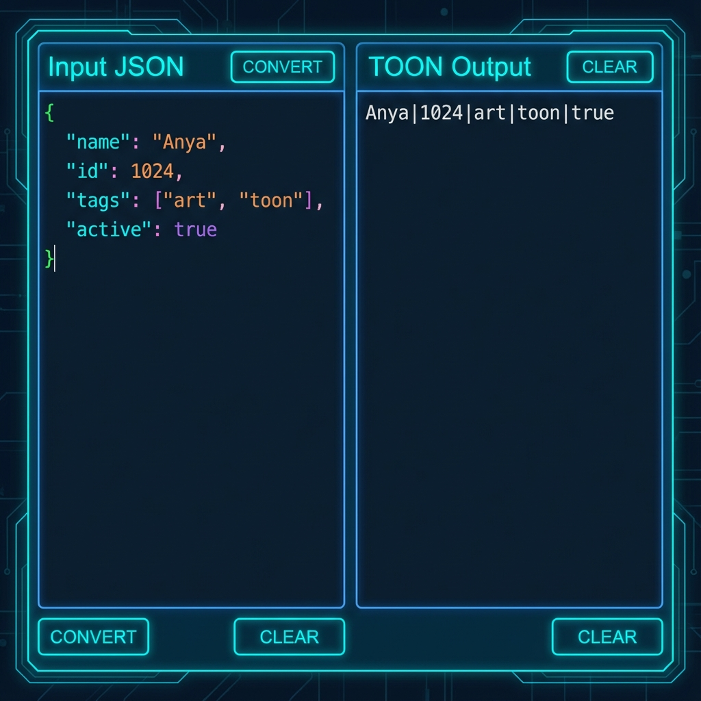

# 🔄 JSON to TOON Converter

> Compress JSON into Token-Oriented Object Notation (TOON) to reduce LLM token usage by up to 50%.

[](https://kartikeykumar.com/tools/toon-converter/)
[](https://react.dev)
[](https://typescriptlang.org)
[](https://vitejs.dev)




## ✨ What is TOON?

**Token-Oriented Object Notation (TOON)** is a compact format for representing arrays of objects. Instead of repeating keys for every object, TOON uses a tabular syntax:

### JSON (Verbose)
```json
[
  {"name": "Alice", "age": 30, "city": "NYC"},
  {"name": "Bob", "age": 25, "city": "LA"},
  {"name": "Charlie", "age": 35, "city": "SF"}
]
```

### TOON (Compact)
```
[name|age|city]
Alice|30|NYC
Bob|25|LA
Charlie|35|SF
```

**Result**: ~50% reduction in tokens for LLM prompts!

## 🚀 Features

- **Real-time Conversion**: Instant JSON to TOON transformation
- **Token Counting**: Compare character and estimated token counts
- **Savings Calculator**: See exact reduction percentages
- **Syntax Highlighting**: Easy-to-read formatted output
- **Copy to Clipboard**: One-click copy for LLM use
- **Error Handling**: Helpful messages for invalid JSON

## 📦 Quick Start

### Prerequisites
- Node.js 18+
- npm or yarn

### Installation

```bash
# Clone the repository
git clone https://github.com/kartikeykumar09/toon-converter.git
cd toon-converter

# Install dependencies
npm install

# Start development server
npm run dev
```

Open [http://localhost:5174](http://localhost:5174) in your browser.

### Build for Production

```bash
npm run build
```

## 🛠️ Tech Stack

| Component | Technology |
|-----------|------------|
| Framework | React 18 + TypeScript |
| Build Tool | Vite 5 |
| Styling | Vanilla CSS (Cyan accent) |
| Icons | Lucide React |

## 📁 Project Structure

```
src/
├── App.tsx              # Main editor component
├── index.css            # Styling
├── main.tsx             # Entry point
└── utils/
    └── toon.ts          # TOON conversion logic
```

## 🔧 TOON Specification

### Format Rules

1. **Header Row**: Column names in brackets, separated by `|`
   ```
   [column1|column2|column3]
   ```

2. **Data Rows**: Values separated by `|`, one row per object
   ```
   value1|value2|value3
   ```

3. **Escaping**: Use `\|` for literal pipe characters

4. **Nested Objects**: Converted to inline JSON

### Conversion Algorithm

```typescript
function toTOON(jsonArray: object[]): string {
  if (!Array.isArray(jsonArray) || jsonArray.length === 0) {
    return JSON.stringify(jsonArray);
  }
  
  const keys = Object.keys(jsonArray[0]);
  const header = `[${keys.join('|')}]`;
  const rows = jsonArray.map(obj => 
    keys.map(k => formatValue(obj[k])).join('|')
  );
  
  return [header, ...rows].join('\n');
}
```

## 🤝 Contributing

Contributions are welcome! Here's how you can help:

### Improving the Converter

1. **Enhanced Nested Support**: Better handling of deeply nested objects
2. **Array Values**: Compact representation for array fields
3. **Type Preservation**: Maintain number/boolean types in output
4. **Reverse Conversion**: TOON → JSON parser

### Development Workflow

1. Fork the repository
2. Create a feature branch: `git checkout -b feature/your-feature`
3. Make your changes
4. Run `npm run build` to verify
5. Commit: `git commit -m "Add your feature"`
6. Push: `git push origin feature/your-feature`
7. Open a Pull Request

## 📊 Token Savings Examples

| Data Type | JSON Tokens | TOON Tokens | Savings |
|-----------|-------------|-------------|---------|
| User list (10 rows) | ~200 | ~100 | **50%** |
| Product catalog | ~500 | ~280 | **44%** |
| Log entries | ~1000 | ~450 | **55%** |

## 📄 License

MIT License - feel free to use this in your own projects!

## 🙏 Acknowledgments

- Built by [Kartikey Kumar](https://kartikeykumar.com)
- Part of the [Free Developer Tools](https://kartikeykumar.com/tools) suite

---

**[🔗 Live Demo](https://kartikeykumar.com/tools/toon-converter/)** | **[🐛 Report Bug](https://github.com/kartikeykumar09/toon-converter/issues)** | **[💡 Request Feature](https://github.com/kartikeykumar09/toon-converter/issues)**
